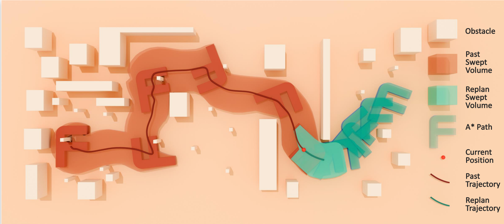
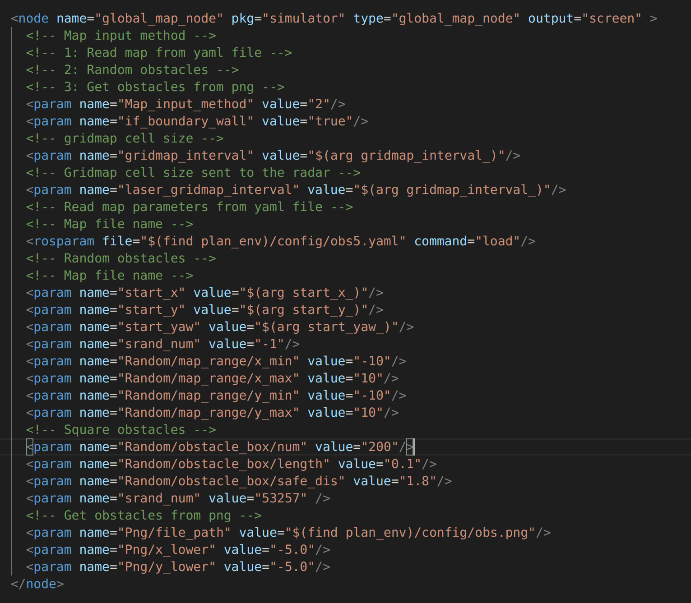

# Real-Time-SVSDF-Planner
Any-shape Real-time Replanning via SVSDF

A more detailed and complete version will be released once the paper’s final draft is finished.

## Version1.0


### Launch the simulation
```
catkin build
source devel/setup.bash
source devel/setup.zsh

roslaunch plan_manager run_sim.launch
```

It's a simple demood 


### Adjust the parameters of the map


### Video

[Bilibili Video](https://www.bilibili.com/video/BV1HCRpY5EiX/)

